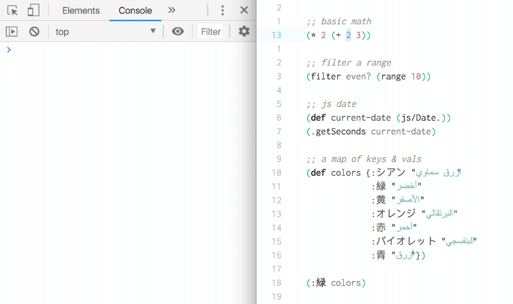

### Description ###
Repl-Repl makes it dead simple to start evaluating Clojurescript code directly in your editor.  
Instant feedback and stylish formatting is delivered straight to your Chrome DevTools console!

### Usage ###
This extension is intended to be used in tandem with a live development environment such as [Figwheel](https://figwheel.org/).

&nbsp;  
Based on where the cursor is, you can do one of the following:

**Evaluate Outermost Form**  
Default keybinding: `cmd-enter` (mac), `alt-enter` (windows)

**Evaluate Current Form**  
Default keybinding: `cmd-alt-enter` (mac), `alt-win-enter` (windows)

**Evaluate Current Expression**  
Default keybinding: `ctrl-cmd-alt-enter` (mac), `shift-ctrl-alt-enter` (windows)

Please customize these keybindings to suit your needs.

Additionally, you can access all the Repl-Repl commands from the following places:  
- The application menu (top of the screen) *Packages > repl-repl > ...*  
- In the dropdown menu (when you click anywhere inside your file), under *repl-repl*  
- Open the command pallette (`cmd-shift-p`) and search for 'Repl Repl'

&nbsp;  
&nbsp;  

Copyright © 2018 JC

