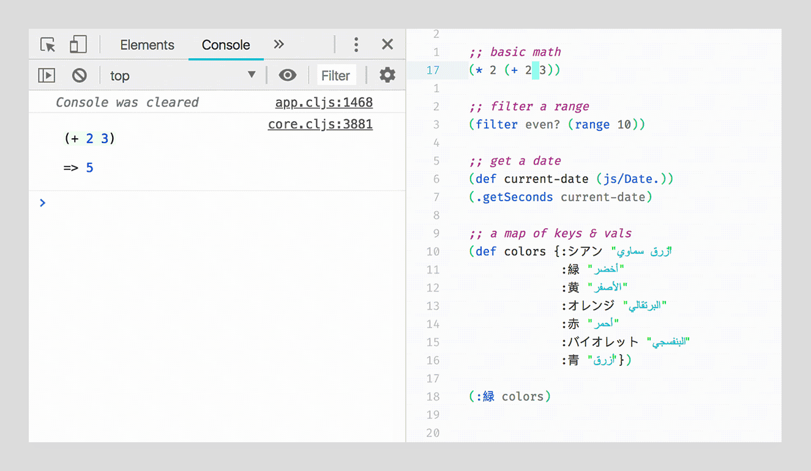

# repl-repl 
&nbsp;  
**repl-repl** makes it dead simple to evaluate Clojurescript code directly in your editor.  
Instant feedback with syntax highlighting is delivered straight to your browser's DevTools console.  
&nbsp;

&nbsp;
## Usage ##
This extension is intended to be used in tandem with a live development environment such as [Figwheel](https://figwheel.org/).

Based on where the cursor is, you can do one of the following:

***Evaluate Outermost Form***  
Default keybinding: `cmd-enter` (mac), `alt-enter` (windows)

***Evaluate Current Form***  
Default keybinding: `cmd-alt-enter` (mac), `alt-ctrl-enter` (windows)

***Evaluate Current Expression***  
Default keybinding: `ctrl-cmd-alt-enter` (mac), `shift-ctrl-alt-enter` (windows)

Please customize these keybindings to suit your needs.  

&nbsp;

You can also access the commands above from the following places:  
- The application menu (top of the screen) "Packages" > "repl-repl" > ...  
- In the dropdown menu (when you click anywhere inside your file), under "repl-repl"  
- Open the command pallette (`cmd-shift-p`) and search for "Repl Repl"

&nbsp;  
Copyright © 2018 JC  
Example animation features the [FiraCode](https://github.com/tonsky/FiraCode) font by [tonsky](https://github.com/tonsky)
